# Flutter UI Design Day 41 50

## Development Setup
Clone the repository and run the following commands:
```
flutter pub get
flutter run
```

# ScreenShot


## Day 41 - Apartment Booking App
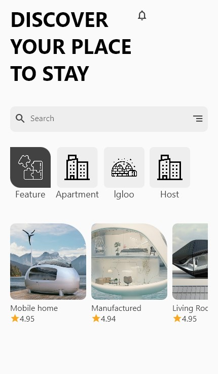 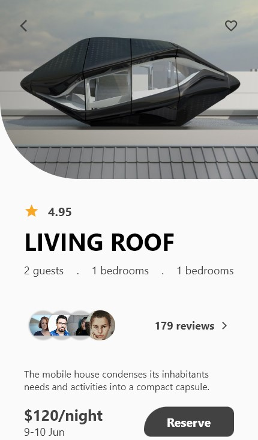

## Day 42 - Travel App Design
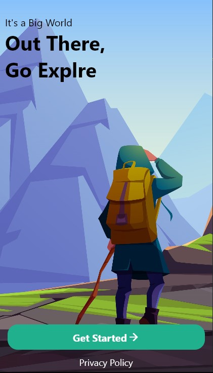 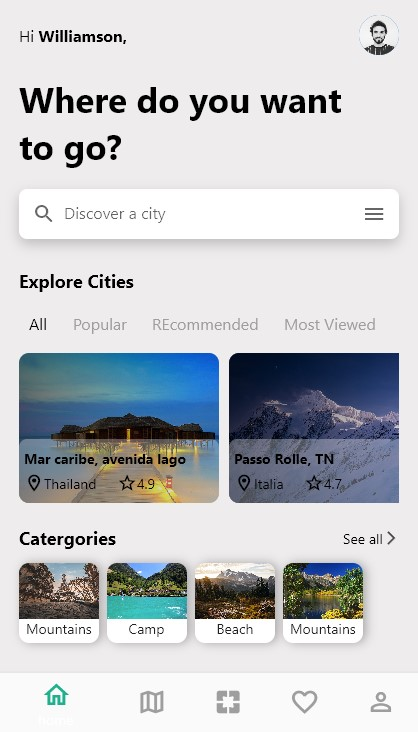 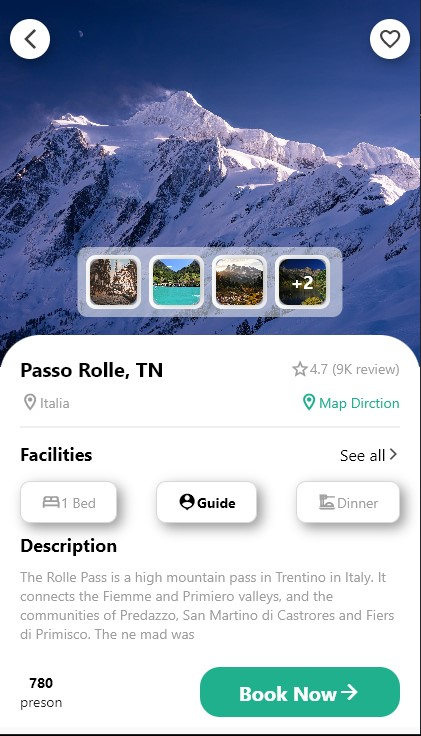

## Day 43 - Caren Family Onboarding
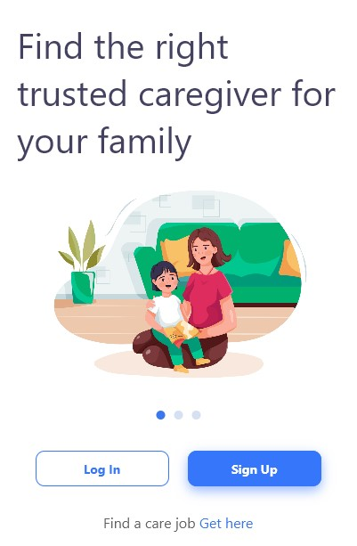 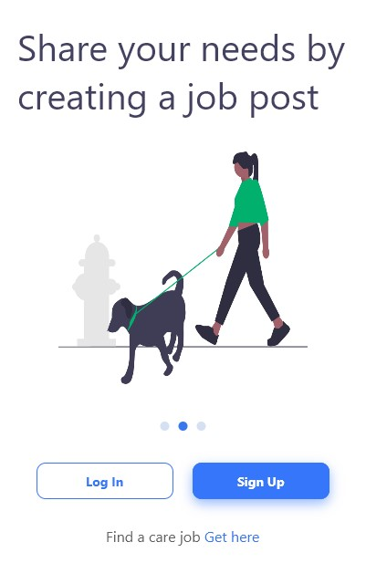 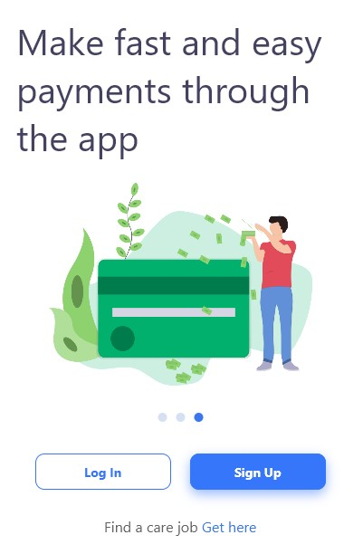

## Day 44 - Travel Mobile App Template
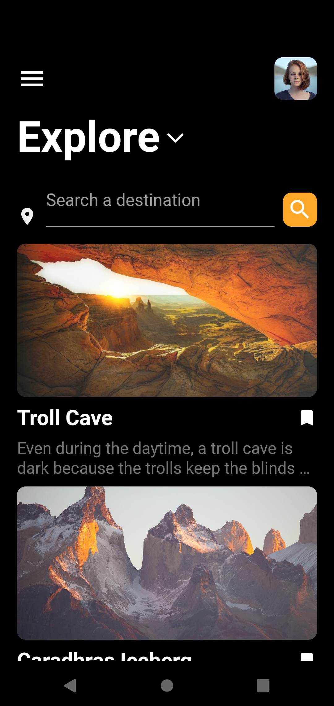 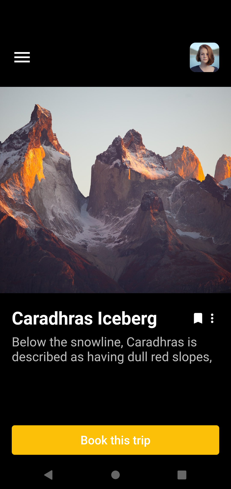 

## Day 45 - Plant Shop App
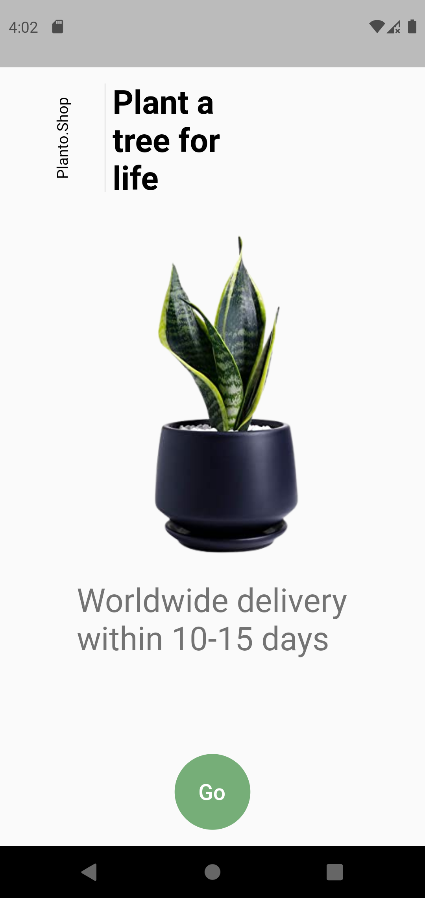 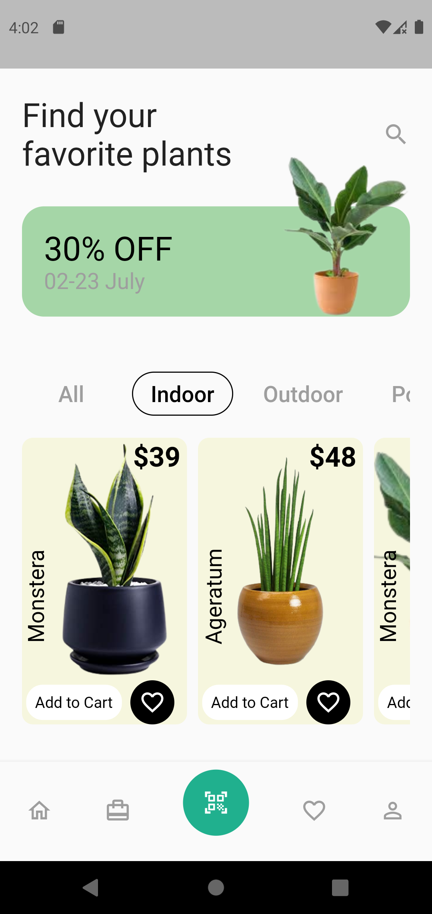 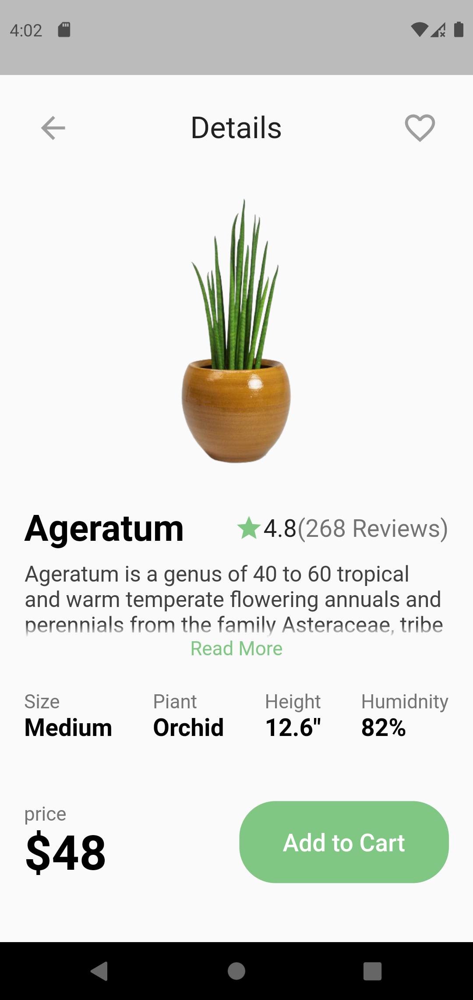

## Day 46 - Wallet App
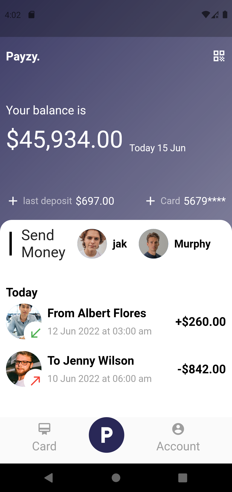 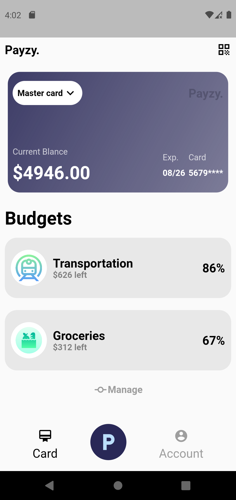 

## Day 47 - 3D+ Art Marketplace Mobile Apps
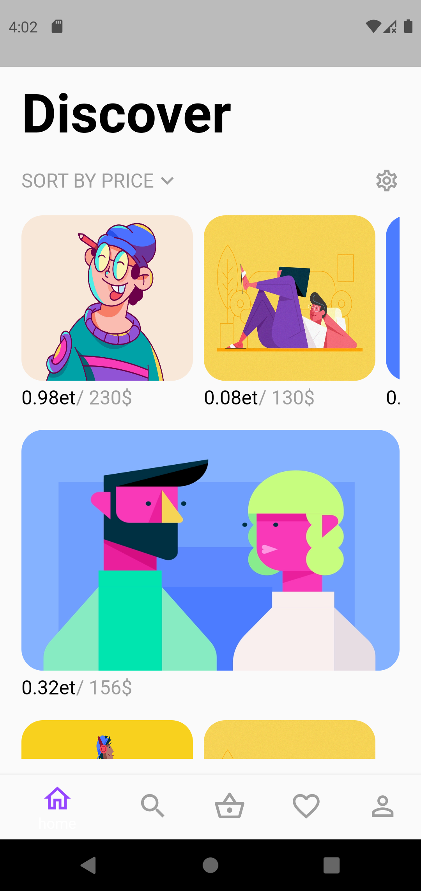 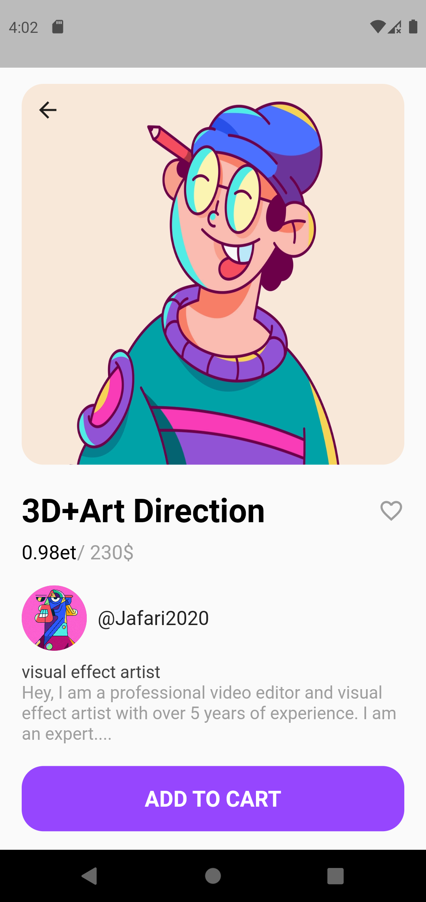 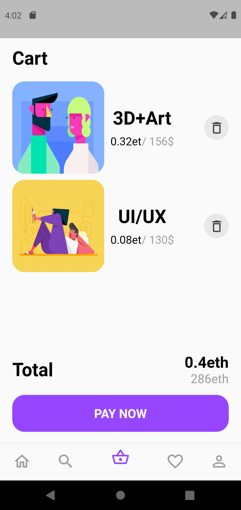

## Day 48 - Medicine Delivery App
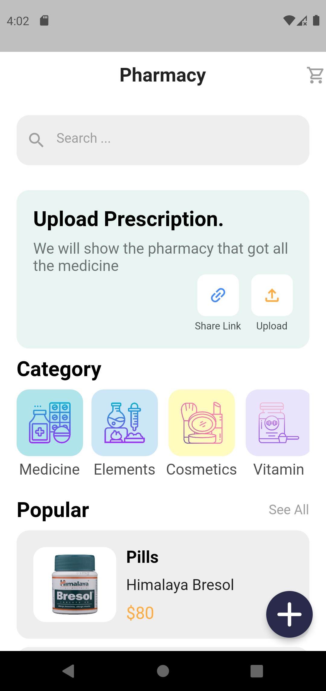 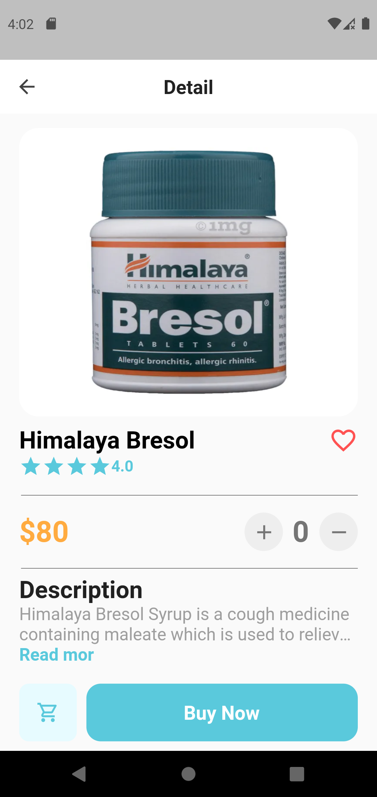 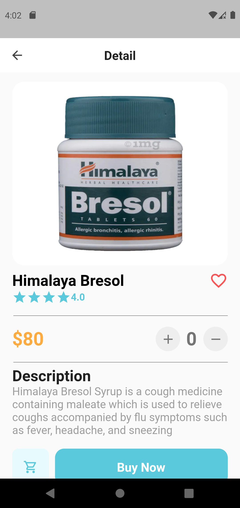

## Day 49 - Mobile Sign up/ Sign in
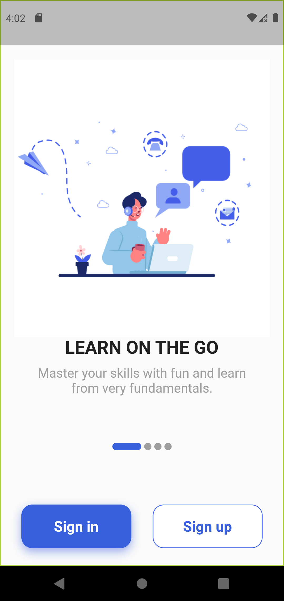 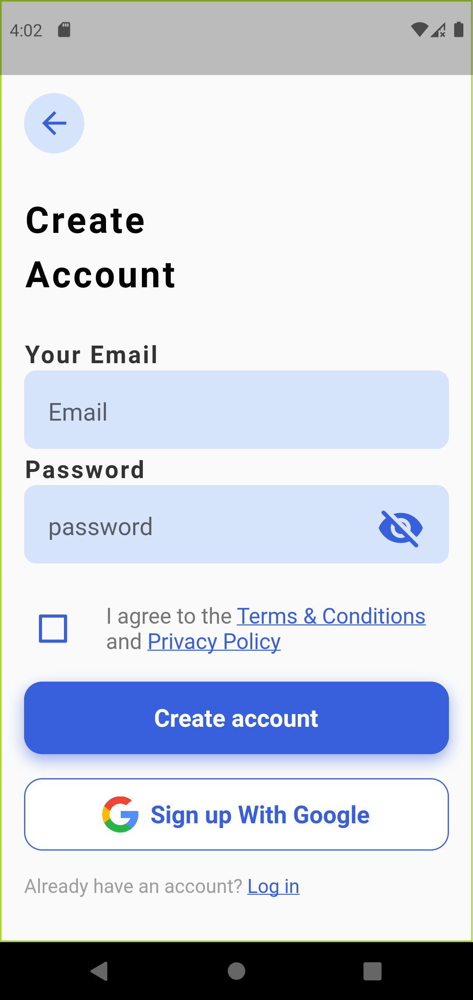<br>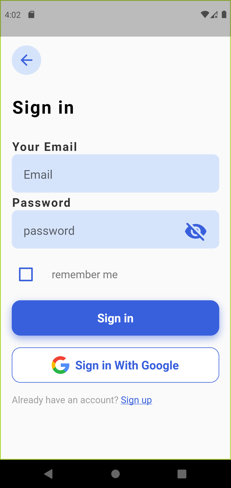 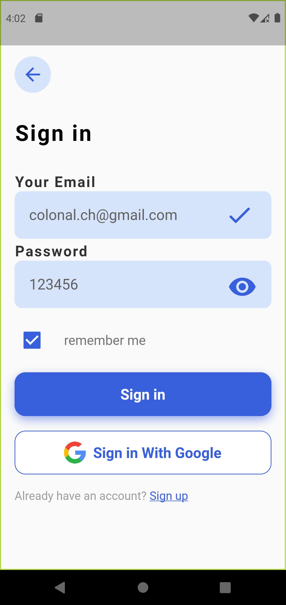